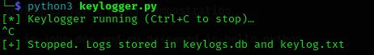
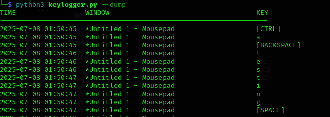
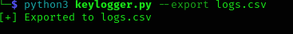

# 🎯 Educational Keylogger — Cross-Platform (Python)

> ⚠ **DISCLAIMER:**  
> This project is for **EDUCATIONAL PURPOSES ONLY**.  
> Use **only** on your own machines or where you have **explicit written consent**.  
> Misuse is illegal and unethical. The author assumes no responsibility for misuse.

---

## 📌 Overview

A lightweight, cross-platform keylogger built in Python to help understand how keystroke capture works.  
It logs keypresses to both an SQLite database and a plaintext `.txt` file.  
Includes tools to search, export, and reconstruct typed input.

---

## 💻 Features

- ✅ Cross-platform: Linux 🐧 / Windows 🪟 / macOS 🍎  
- ✅ Logs all keystrokes with timestamp  
- ✅ Logs active window title (Windows & Linux via `xdotool`)  
- ✅ Stores logs in SQLite (`keylogs.db`)  
- ✅ Also stores logs in plain text (`keylog.txt`)  
- ✅ Full CLI interface:
  - Dump logs  
  - Character/Window search  
  - Smart full-text search (password, email, etc.)  
  - Reconstruct full typed sentences  
  - CSV export

---

## ⚙ Requirements

- Python 3.7+
- `pynput` for key capture

Install via pip:

```bash
pip install pynput
```

### Optional for Active Window Title Logging:

#### 🪟 Windows:
```bash
pip install pygetwindow pywin32
```

#### 🐧 Linux:
```bash
sudo apt install xdotool
```

---

## 📦 Installation

```bash
git clone https://github.com/yourname/educational-keylogger.git
cd educational-keylogger
python3 keylogger.py
```

---

## 🚀 Usage

### ▶ Start Logging

```bash
python3 keylogger.py
```

- Starts listening for key presses.
- Press `Ctrl+C` to stop.
- Logs saved in both `keylogs.db` and `keylog.txt`.

---

### 📝 Dump All Logs

```bash
python3 keylogger.py --dump
```

Prints all saved logs:

```
TIME                 WINDOW                                  KEY
2025-07-06 00:44:36  Terminal                                h
2025-07-06 00:44:37  Terminal                                e
...
```

---

### 🔍 Search by Key/Window Title

```bash
python3 keylogger.py --search chrome
```

Finds rows where:
- key = `chrome`
- OR window title includes `chrome`

---

### 🧠 Smart Full-Text Search

```bash
python3 keylogger.py --smart-search password
```

Reconstructs full input like:

```
email: fake@gmail.com password: Pass@123
```

Output:

```
--------------------------------------------------
email: fake@gmail.com password: Pass@123
--------------------------------------------------
[✅] FOUND: 'password' detected in reconstructed input.
```

---

### 📜 Reconstruct All Typed Text

```bash
python3 keylogger.py --reconstruct
```

Shows the full input typed in one stream (ignores special keys like [SHIFT], [CTRL], etc).

---

### 📤 Export Logs to CSV

```bash
python3 keylogger.py --export logs.csv
```

Generates a clean CSV file:

```
timestamp,window,key
2025-07-06 00:44:37,Terminal,h
...
```

---

## 🗃 Database Format

- File: `keylogs.db`
- Table: `keystrokes`

| Column  | Type    | Description                  |
|---------|---------|------------------------------|
| id      | INTEGER | Auto-increment ID            |
| ts      | TEXT    | Timestamp (YYYY-MM-DD HH:MM) |
| window  | TEXT    | Window title (if captured)   |
| key     | TEXT    | Captured key or [KEYNAME]    |

---

## 📂 Project Structure

```
educational-keylogger/
├── keylogger.py        # Main script
├── keylogs.db          # Log database (auto-created)
├── keylog.txt          # Plain text keystroke log
├── README.md           # This file
└── assets/             # Screenshots (pic1.png ... pic5.png)
```

---

---

## 📸 Screenshots

> Example outputs from different parts of the keylogger in action.

---

### 🔹 Screenshot 1  
**Live keylogging in action (real-time logging to DB & TXT):**



---

### 🔹 Screenshot 2  
**Using `--dump` to print all logs from the database:**



---

### 🔹 Screenshot 3  
**Smart reconstructed search using `--smart-search password`:**


---

### 🔹 Screenshot 4  
**Exporting logs to CSV using `--export logs.csv`:**



---

### 🔹 Screenshot 5  
**Plaintext logging to `keylog.txt` shown in a text viewer:**


---

## 🚫 Legal Notice

> ⚠ This tool is meant **only** for:
- Cybersecurity education
- Honeypots
- Local red team simulations
- Ethical hacking labs

❌ Do NOT use this on others’ systems without full permission.  
📜 You are fully responsible for what you do with it.

---

## ✅ License

MIT-style license — educational use only.  
No liability for misuse.

